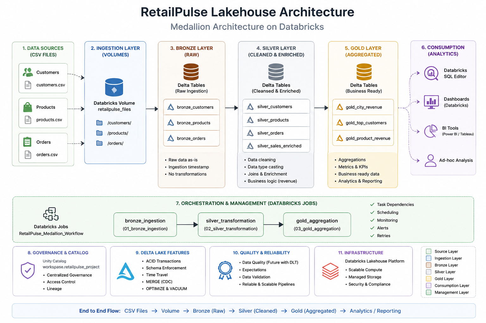

# RetailPulse Lakehouse Pipeline

End-to-End Lakehouse Data Engineering Project built using Databricks, PySpark, Delta Lake, and Medallion Architecture.

---

## Project Overview

RetailPulse simulates a retail analytics platform that ingests customer, product, and order data, processes it through Bronze, Silver, and Gold layers, and generates business-ready revenue analytics.

The project demonstrates core Data Engineering concepts including:

- Data Ingestion
- Delta Lake Tables
- Medallion Architecture
- Data Transformations
- Workflow Orchestration
- Change Data Capture (CDC)
- Delta Lake Transaction Log
- Time Travel & Restore
- Git Integration

---

## Architecture



---

## Tech Stack

| Component | Technology |
|------------|------------|
| Data Platform | Databricks Free Edition |
| Processing Engine | Apache Spark / PySpark |
| Storage Format | Delta Lake |
| Catalog | Unity Catalog |
| Workflow Orchestration | Databricks Jobs |
| Version Control | GitHub |
| Source Files | CSV |
| Architecture Pattern | Medallion Architecture |

---

## Source Data

### Customers

| Column |
|----------|
| customer_id |
| name |
| city |

### Products

| Column |
|----------|
| product_id |
| product_name |
| category |
| price |

### Orders

| Column |
|----------|
| order_id |
| customer_id |
| product_id |
| quantity |
| order_date |

---

# Medallion Architecture

## Bronze Layer

Purpose:
- Raw Data Ingestion
- Minimal Transformation
- Auditability

Tables:

- bronze_customers
- bronze_products
- bronze_orders

Operations:

- Read CSV files from Databricks Volume
- Add ingestion_timestamp
- Store as Delta Tables

Notebook:

```text
notebooks/01_bronze_ingestion.ipynb
```

---

## Silver Layer

Purpose:
- Data Cleansing
- Data Standardization
- Business Enrichment

Transformations:

- Data Type Casting
- Join Customers + Orders + Products
- Revenue Calculation

Formula:

```text
Revenue = Quantity × Price
```

Tables:

- silver_customers
- silver_products
- silver_orders
- silver_sales_enriched

Notebook:

```text
notebooks/02_silver_transformation.ipynb
```

---

## Gold Layer

Purpose:
- Business Reporting
- Analytics Ready Data

Aggregation:

Revenue by City

Table:

- gold_city_revenue

Sample Output:

| City | Total Revenue |
|--------|------------|
| Chennai | 55000 |
| Coimbatore | 12000 |
| Bangalore | 4500 |
| Hyderabad | 2500 |
| Madurai | 1000 |

Notebook:

```text
notebooks/03_gold_aggregation.ipynb
```

---

# Workflow Orchestration

Databricks Job created to automate the complete pipeline.

Execution Flow:

```text
Bronze Ingestion
        ↓
Silver Transformation
        ↓
Gold Aggregation
```

Features:

- Task Dependencies
- Sequential Execution
- Serverless Compute
- Job Monitoring

---

# Delta Lake Features Demonstrated

## Delta Tables

All layers are stored as Delta Tables.

---

## MERGE (CDC)

Implemented Change Data Capture using:

```sql
MERGE INTO
```

Capabilities:

- Update Existing Records
- Insert New Records
- Maintain Historical Versions

---

## Transaction Log

Used:

```sql
DESCRIBE HISTORY
```

to inspect Delta transaction history.

Tracked Operations:

- CREATE TABLE
- MERGE
- OPTIMIZE

---

## Time Travel

Used:

```sql
VERSION AS OF
```

to query historical versions of Delta tables.

---

## Restore

Used:

```sql
RESTORE TABLE
```

to recover previous table versions.

---

## Optimize

Used:

```sql
OPTIMIZE
```

to compact small Delta files.

---

# Repository Structure

```text
medallion-lakehouse-pipeline-retailpulse
│
├── architecture
│   └── medallion_lakehouse.png
│
├── notebooks
│   ├── 01_bronze_ingestion.ipynb
│   ├── 02_silver_transformation.ipynb
│   └── 03_gold_aggregation.ipynb
│
├── screenshots
│   ├── workflow_success.png
│   ├── delta_history.png
│   └── gold_city_revenue.png
│
└── README.md
```

---

# Key Learnings

- Built an end-to-end Medallion Architecture pipeline.
- Worked with Delta Lake tables.
- Implemented CDC using MERGE.
- Explored Delta Transaction Logs.
- Practiced Time Travel and Restore.
- Automated execution using Databricks Jobs.
- Integrated Databricks with GitHub.

---

# Future Enhancements

- Delta Live Tables (DLT)
- Auto Loader
- Structured Streaming
- AWS S3 Integration
- Unity Catalog Governance
- Data Quality Expectations
- CI/CD Deployment

---

## Author

Mohamed Sulaiman

Senior Data Engineer

Databricks | PySpark | Delta Lake | Lakehouse Architecture
